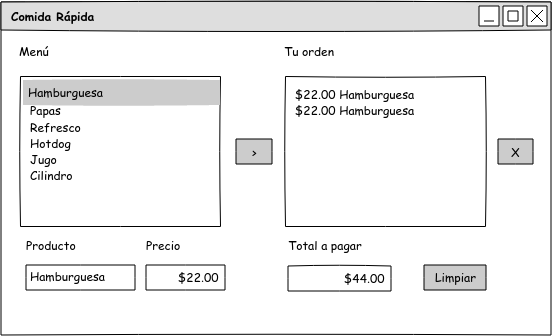
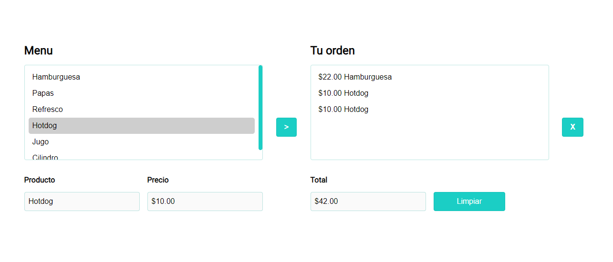

# Menu-comida-rapida-.net-

# Autor
- Simja

# Imagenes

#### Mockup


### Screen


### Features

- Use the POO
- Use 3 layers
- Use the asp.net languaje

## Requirements

1. Button for add a item.
2. Button for delete one item.
3. Button for clean all the app.
4. Menu for the products.
5. Section for preview the name and the price of any product.

## Functions

1. add items to the order.
2. delete items to the order.
3. update the total price of the order.
4. By clicking on a menu item, you can preview the name and price of the product.
5. for delete one item of the order firts you shoud click it.
6. you can cleand all the inputs


### Diagrams

Class Comida  |               |
------------- | ------------- |
string        | nombre        |
double        | precio        |


Class Default  |               |
-------------- | ------------- |
ListBox        | cboMenu       |
ListBox        | cboOrden      |
ListBox        | cboVer        |
ArrayList      | listaComidas  |
ArrayList      | listaOrden    |
TextBox        | txtName       |
TextBox        | txtPrice      |
TextBox        | txtTotal      |
double         | total         |


# Code Methods
 
```c#
protected void Page_Load(Object sender, EventArgs e) {
    //... to render the page
}
```

```c#
 public void btn_Agregar_Click(Object sender, EventArgs e) {
    //... fuction add a new item to the order
}
```

```c#
public void Menu_SelectedIndexChanged_Click(Object sender, EventArgs e) {
    //... fuction to detect the event click in one product of the menu
}
```

```c#
public void btn_Quitar_Click(Object sender, EventArgs e) {
    //... fuction remove one item in the order
}
```

```c#
public void btn_Limpiar_Click(Object sender, EventArgs e) {
    //... fuction to clean all the inputs in the app
}
```